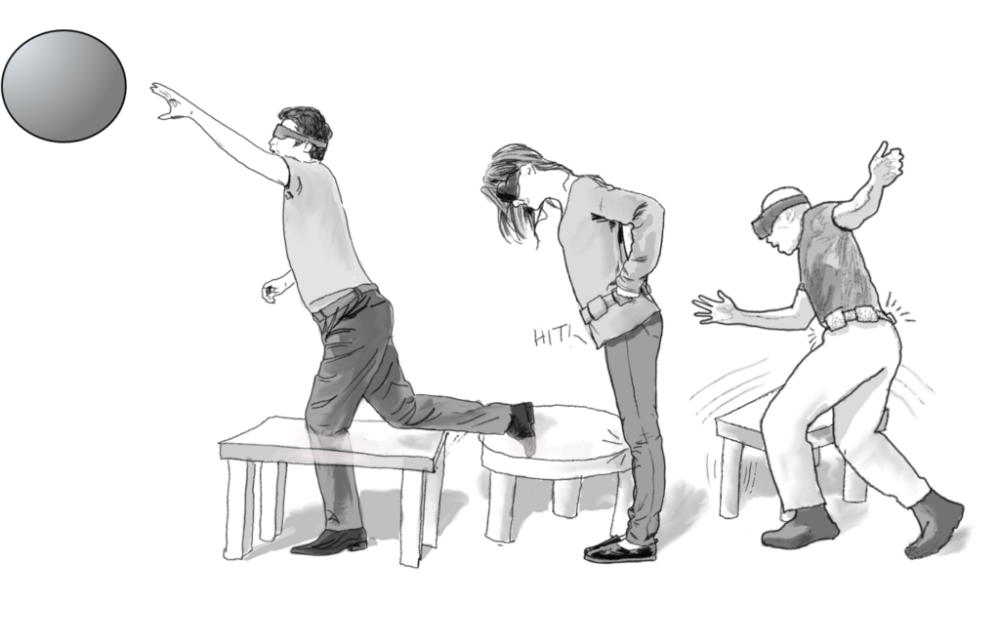
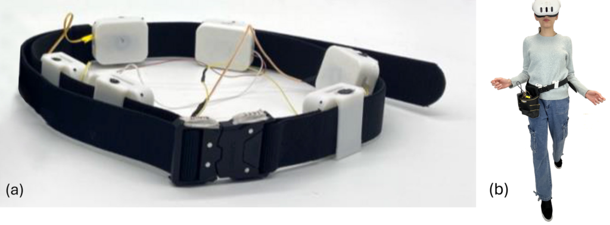
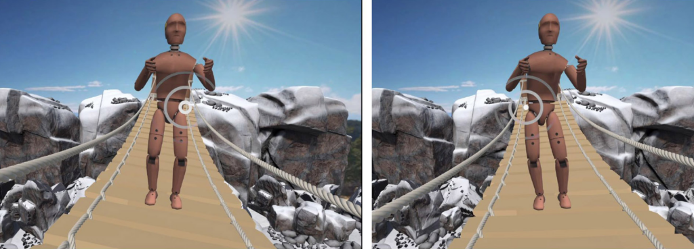
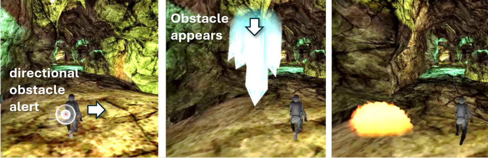
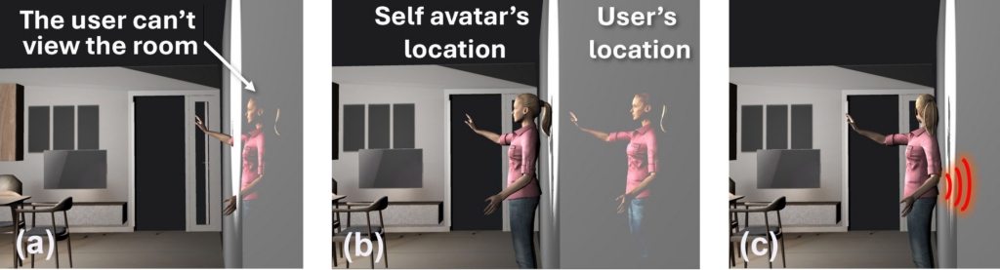

<article class="lab-blog-article">
  <header class="lab-blog-article-header">
    
Prof. Eyal Ofek

    
University of Birmingham. UK

  </header>

  <figure class="lab-blog-figure lab-blog-figure-lead">
    
    <figcaption><strong>Figure 1:</strong> VR users usually lack haptic feedback from the lower body, making it easy for users to unintentionally intersect with virtual obstacles. A haptic belt that can render collisions (b) as well as a gradual sense of closing on obstacles (c) raises spatial awareness of the users.</figcaption>
  </figure>

  
Imagine walking through a dark room at night, trying to find your keys without waking anyone. You can't turn on the lights, so you move slowly, arms outstretched, reading the space through subtle cues - the faint vibration of furniture nearby, the shift of air around a chair. You're navigating by feel, hoping not to knock anything over.

  
This everyday experience turns out to be surprisingly relevant to the future of Virtual Reality.

  <h2>Blind in Plain Sight</h2>

  
A person wearing a VR headset is, for all practical purposes, blind to their physical surroundings. To stay safe, VR users are typically asked to clear a room of obstacles before putting on their headset. When they approach the edge of their designated play area, the headset displays a virtual boundary - a visual fence that breaks immersion but prevents collisions.

  
The problem doesn't end there. Even within the virtual world itself, users have almost no haptic awareness below the waist. A player might glance down mid-game to discover they're standing directly inside a virtual coffee table. It sounds harmless - after all, no one gets hurt by a virtual table - but <a href="https://eyalofek.org/wp-content/uploads/2023/04/CHI23_EmbodiedPhysics.pdf" target="_blank" rel="noopener">research presented at CHI 2023, the leading Human-Computer Interaction conference,</a> found that violations of physical rules in VR measurably reduce immersion. Conversely, when a user's virtual avatar respects physical laws - even when that means moving differently from the user's actual body - immersion increases.

  <h2>A Belt That Lets You Feel the Virtual World</h2>

  
Researchers at the VR Laboratory of the University of Birmingham have developed a novel approach to this problem. Their team - Dr. Diar Abdlkarim, Devika Mukherjee, Dr. Daniele Giunchi, Dr. Massimiliano DiLuca, and Prof. Eyal Ofek - designed a haptic belt that gives users awareness of obstacles around their lower body, both physical and virtual.

  
Their paper, <a href="https://pure-oai.bham.ac.uk/ws/portalfiles/portal/295068678/BeltAndWhistles_CHI26.pdf" target="_blank" rel="noopener">"Belt and Whistles: Adding Lower Body Collision Awareness for MR Experiences,"</a> will be presented at the CHI conference in Barcelona this month.

  
The belt is battery-powered, wireless, and designed to fit a range of body types. It connects directly to a standalone Meta Quest 3 headset and delivers directional haptic signals - meaning the user can feel not just that something is nearby, but which direction it's coming from. Six voice coils embedded around the belt produce two distinct types of feedback: a sharp pulse when the user's body makes contact with a virtual object, and a soft, gradually intensifying signal as the user draws closer to one.

  
This dual-mode design was deliberate. The researchers wanted the belt's signals to complement VR applications rather than compete with them - staying out of the way during intense moments while still guiding users toward safer, more physically coherent movement.

  <figure class="lab-blog-figure">
    
    <figcaption><strong>Figure 2:</strong> A battery-operated belt, wirelessly connected to a Meta Quest 3 headset, enables rendering of a range of signals of lower-body haptics and scene awareness signals.</figcaption>
  </figure>

  <h2>Does It Work?</h2>

  
Testing the belt across different scenarios, the team found that in high-stress gaming environments, the haptic feedback did not hurt player performance - but it did lead players to navigate more physically plausible paths through virtual space, improving their sense of presence. In calmer, more exploratory applications, users were able to navigate a darkened virtual room and locate targets while avoiding furniture entirely by feel.

  <figure class="lab-blog-figure">
    
    <figcaption><strong>Figure 3:</strong> Rendering of haptic signal in sync with the sway of the bridge, can help make the experience more realistic.</figcaption>
  </figure>

  
The potential applications extend further still. The belt can render the sway of an unstable virtual bridge (See Figure 3), making the experience feel physically grounded. It can signal the vibrations of approaching objects - crystals crashing toward a player, for instance - before they come into view or earshot, giving users a premonition of what's about to happen (See Figure 4). It can also alert users when they're about to walk backward into a real wall, a disorienting experience that currently leaves many VR users feeling suddenly out of control.

  <figure class="lab-blog-figure">
    
    <figcaption><strong>Figure 4:</strong> Cave Run: The haptics signals of the belt render the vibrations as crystals crash in front of the player. While objects are yet to be seen or heard, their motion can be used as a premonition signal to help the player.</figcaption>
  </figure>

  <h2>A Step Toward Full-Body VR</h2>

  
Haptic research in VR has long focused almost exclusively on the hands. The haptic belt represents a different philosophy - one that treats the whole body as a surface worth addressing. The device is inexpensive, adaptable, and easy to use, and the researchers hope its simplicity will encourage broader exploration of full-body haptics in mixed reality.

  <figure class="lab-blog-figure">
    
    <figcaption><strong>Figure 5:</strong> A person wearing a VR headset is walking back into a wall, and as a result loses the view of the room (a). While the user's avatar is prevented from entering the wall, nothing stops the user from walking backward and feeling they lost control of their VR experience (b). Using the haptic belt, the user is aware of reaching the wall and stops backing up (c).</figcaption>
  </figure>

  
Belt and Whistles: Video presentation:

  <figure class="lab-blog-video">
    

      <iframe loading="lazy" title="Belt and Whistles- adding lower-body collision awareness for MR experiences - CHI 2026" src="https://www.youtube.com/embed/7EFfIZDtSaM?feature=oembed" allow="accelerometer; autoplay; clipboard-write; encrypted-media; gyroscope; picture-in-picture; web-share" referrerpolicy="strict-origin-when-cross-origin" allowfullscreen></iframe>
    

  </figure>

  
Original post: <a href="https://eyalofek.org/beltandwhistles/" target="_blank" rel="noopener">https://eyalofek.org/beltandwhistles/</a>

</article>
