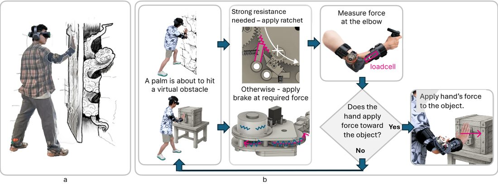
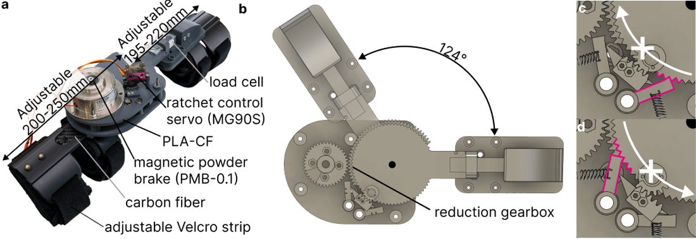
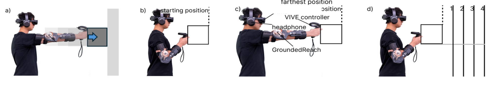
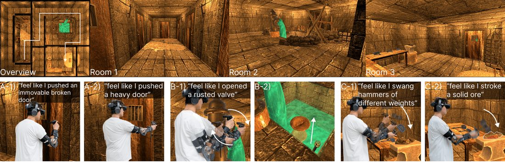

<article class="lab-blog-article">
  
A vibrating controller can signal contact with a virtual wall, but it cannot stop the hand passing through it. GroundedReach investigates whether resistance at a single joint can make nearby virtual objects feel solid. The project brings together researchers from the University of Birmingham, the Southern University of Science and Technology, and the University of Washington.

  <figure class="lab-blog-figure">
    
    <figcaption><strong>Figure 1:</strong> GroundedReach resists elbow movement when the hand encounters a virtual object.</figcaption>
  </figure>

  <h2>Resistance at one joint</h2>

  
Real contact transmits forces through several joints. Reproducing this mechanically can require a complex exoskeleton or a device anchored to the environment. GroundedReach instead targets interactions within arm's reach while the user remains relatively stationary.

  
In a preliminary study with 15 participants, adding shoulder resistance to elbow resistance produced no statistically significant improvement in perceived realism. Elbow resistance combined with controller vibration received the highest realism and expressivity ratings. These findings motivated the single-joint design; they do not establish that elbow feedback reproduces every aspect of physical contact.

  
A magnetic powder brake supplies adjustable resistance, while a directional ratchet can stop elbow extension or flexion. A load cell detects changes in the user's applied force, allowing the brake to release when the user eases off.

  <figure class="lab-blog-figure">
    
    <figcaption><strong>Figure 2:</strong> The device combines a brake, reduction gearbox, ratchet and force sensor.</figcaption>
  </figure>

  <h2>Faster contact, with an accuracy trade-off</h2>

  
In an 18-participant study, users pushed a virtual box towards a wall with visual feedback alone, visual feedback plus controller vibration, or visual feedback plus GroundedReach. Mean completion times were 3.37, 1.78 and 0.96 seconds, respectively. GroundedReach also reduced total hand travel.

  
Speed did not imply greater accuracy. Mean positional error was 4.2 cm with GroundedReach, compared with 2.6 cm with vibration and 4.1 cm with visuals alone. Vibration was significantly more accurate than either alternative; GroundedReach and visual-only feedback did not differ significantly.

  <figure class="lab-blog-figure">
    
    <figcaption><strong>Figure 3:</strong> Participants stopped a virtual box at different distances within their reach.</figcaption>
  </figure>

  <h2>Doors, valves and hammers</h2>

  
A further 12 participants explored a dungeon containing doors, a valve and hammers. GroundedReach provided stopping cues, rotational resistance and simulated weight and impact. Realism and enjoyment ratings were significantly higher with haptic feedback in all three rooms than with visuals alone. This study did not include a vibration-only comparison.

  <figure class="lab-blog-figure">
    
    <figcaption><strong>Figure 4:</strong> The dungeon demonstrated several forms of resistance during object interaction.</figcaption>
  </figure>

  <h2>What remains limited</h2>

  
The passive mechanisms resist motion but cannot actively push or pull the arm. Shoulder movement can still carry the hand through a virtual surface. The prototype also requires tethered power, and extended-wear comfort remains to be evaluated. GroundedReach is intended to complement controllers for nearby object interaction; the results do not demonstrate complete physical constraint or suitability for precision positioning.

  <h2>Paper and video</h2>

  
<em>GroundedReach: Enabling Body-grounded Haptic Experience in Virtual Reality with an Elbow Wearable Haptic Device</em>, by Yilong Lin, Tianze Xie, Yuxin Ma, Daniele Giunchi, Mike J. Sinclair, Seungwoo Je and Eyal Ofek, is listed as accepted/in press in <em>IEEE Transactions on Visualization and Computer Graphics</em>, associated with ISMAR 2026. Read the <a href="https://research.birmingham.ac.uk/en/publications/groundedreach-enabling-body-grounded-haptic-experience-in-virtual/" target="_blank" rel="noopener">publication record</a> or <a href="https://pure-oai.bham.ac.uk/ws/portalfiles/portal/311720419/ismar26a-sub1203-cam-i5.pdf" target="_blank" rel="noopener">accepted manuscript</a>.

  <figure class="lab-blog-video">
    

      <iframe loading="lazy" title="GroundedReach ISMAR 2026 video" src="https://www.youtube-nocookie.com/embed/3kP6oUKKZEA" allow="accelerometer; autoplay; clipboard-write; encrypted-media; gyroscope; picture-in-picture; web-share" referrerpolicy="strict-origin-when-cross-origin" allowfullscreen></iframe>
    

    <figcaption><a href="https://www.youtube.com/watch?v=3kP6oUKKZEA" target="_blank" rel="noopener">Watch the GroundedReach video on YouTube</a>.</figcaption>
  </figure>

  
Adapted from <a href="https://eyalofek.org/research-blog-grounded-reach/" target="_blank" rel="noopener">Prof. Eyal Ofek's August 2026 research blog</a>, with study details checked against the <a href="https://pure-oai.bham.ac.uk/ws/portalfiles/portal/311720419/ismar26a-sub1203-cam-i5.pdf" target="_blank" rel="noopener">accepted manuscript</a>. Figures by Lin and colleagues, reproduced from the research blog; corresponding figures appear in the manuscript, available under <a href="https://creativecommons.org/licenses/by/4.0/" target="_blank" rel="noopener">CC BY</a>. Captions have been rewritten.

</article>
