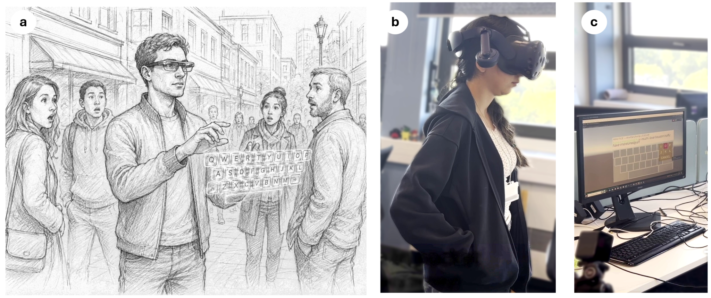
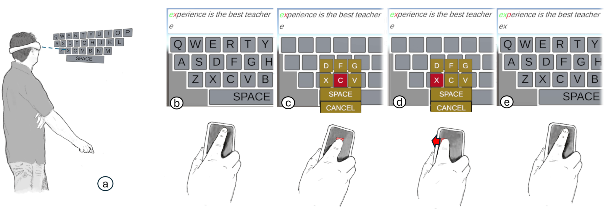
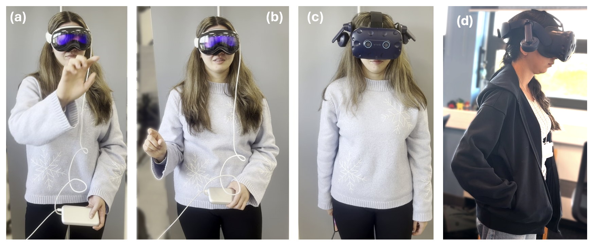

<article class="lab-blog-article">
  <header class="lab-blog-article-header">
    
Prof. Eyal Ofek

    
University of Birmingham, UK · August 2026

  </header>

  
Text entry remains difficult on smart glasses and mixed-reality headsets. Speech is conspicuous and may disclose private content, while mid-air keyboards and pinch gestures can attract attention and become tiring. A new technique developed by researchers at the Universities of Birmingham and Cambridge explores a more discreet alternative.

  <figure class="lab-blog-figure">
    
    <figcaption><strong>Figure 1:</strong> Mid-air gestures can reveal that a person is typing. Implicit Gaze+Slide instead combines gaze with small finger movements on a phone.</figcaption>
  </figure>

  <h2>Combining gaze with touch</h2>

  
Gaze is fast, but it is not a precise pointing signal. Eye movements contain natural jitter, tracking can drift, and a visible gaze cursor may encourage users to consciously steer their eyes. Implicit Gaze+Slide therefore treats gaze as an approximate, one-time prediction rather than a continuously controlled pointer.

  
The user looks towards a key on a virtual QWERTY keyboard and touches a phone held in the hand or pocket. At that instant, the system samples gaze and presents a 3 × 3 group of candidate keys around the estimated target. The user slides a finger to refine the selection and releases it to enter the character. After the initial sample, selection depends on the short finger movement rather than further gaze control.

  <figure class="lab-blog-figure">
    
    <figcaption><strong>Figure 2:</strong> The system samples gaze when the user touches the phone, displays nine candidate keys, and uses a short slide-and-release gesture for final selection.</figcaption>
  </figure>

  <h2>Speed, accuracy and workload</h2>

  
In a controlled comparison, Implicit Gaze+Slide achieved 11.51 words per minute, compared with 12.54 words per minute for an explicit-gaze baseline; the difference was not statistically significant. Its character error rate was 5.49%, compared with 9.38% for the baseline. Participants also reported lower physical and mental demand on the NASA Task Load Index and a stronger perception of their own performance.

  <h2>Perceived privacy</h2>

  
A separate survey asked 15 participants to assess videos of three techniques from a bystander's perspective. On a seven-point scale, Implicit Gaze+Slide received a mean perceived-privacy rating of 6.27. Gaze with a pinch gesture received 4.93, and mid-air keyboard tapping received 3.07. These results concern perceived discretion; they do not constitute a test of information security or resistance to deliberate observation.

  <figure class="lab-blog-figure">
    
    <figcaption><strong>Figure 3:</strong> Bystander views used to compare perceived privacy. The in-pocket demonstration illustrates a later configuration and was not included in the survey.</figcaption>
  </figure>

  <h2>Publication and video</h2>

  
The paper, <em>Implicit Gaze+Slide: Discrete and Low-Effort Typing for MR Using Gaze-Based Prediction and Finger Motion Refinement</em>, by Maisy M. Rapata, Jiaqi Tang, M. Eslami, Daniele Giunchi, Massimiliano Di Luca, Per Ola Kristensson and Eyal Ofek, is forthcoming in the proceedings of the 14th ACM Symposium on Spatial User Interaction (SUI 2026).

  <figure class="lab-blog-video">
    

      <iframe loading="lazy" title="Implicit Gaze+Slide video for SUI 2026" src="https://www.youtube-nocookie.com/embed/1V_a-HytYrw" allow="accelerometer; autoplay; clipboard-write; encrypted-media; gyroscope; picture-in-picture; web-share" referrerpolicy="strict-origin-when-cross-origin" allowfullscreen></iframe>
    

    <figcaption><a href="https://www.youtube.com/watch?v=1V_a-HytYrw" target="_blank" rel="noopener">Watch the Implicit Gaze+Slide video on YouTube</a>.</figcaption>
  </figure>

  
Adapted from <a href="https://eyalofek.org/research-blog-implicit-gaze-slide/" target="_blank" rel="noopener">Prof. Eyal Ofek's original research blog</a>. Publication details were checked against <a href="https://pokristensson.com/publications.html" target="_blank" rel="noopener">Prof. Per Ola Kristensson's publication list</a>.

</article>
