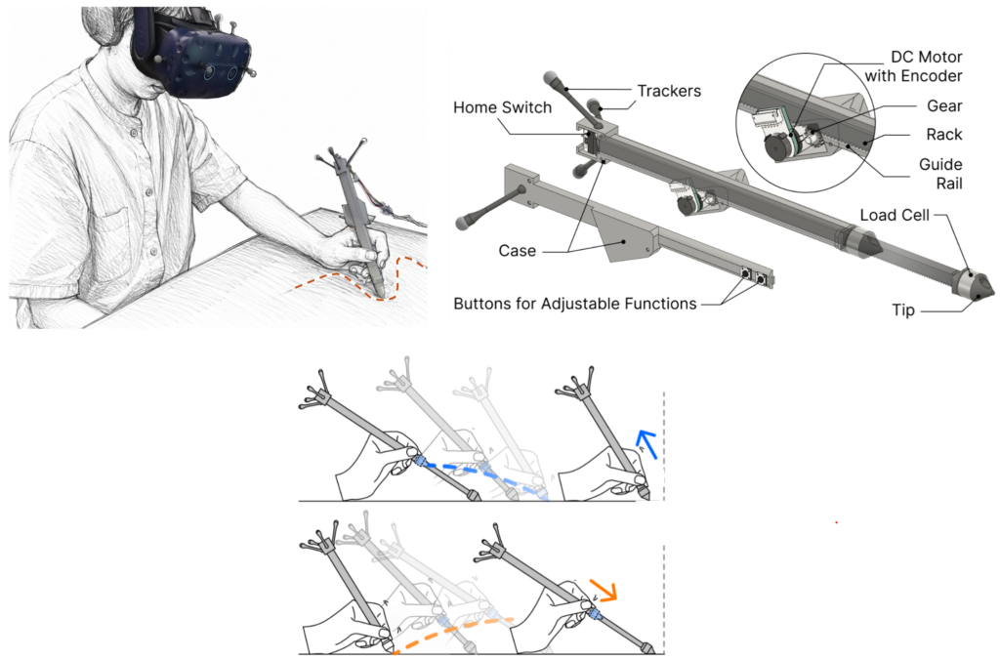
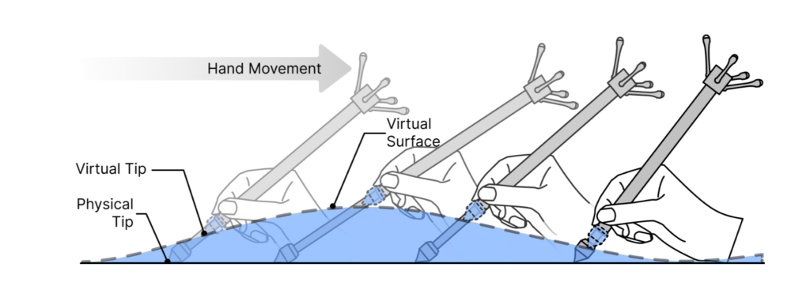
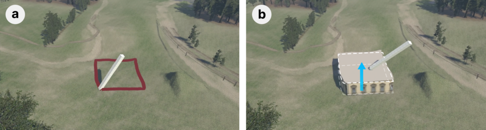
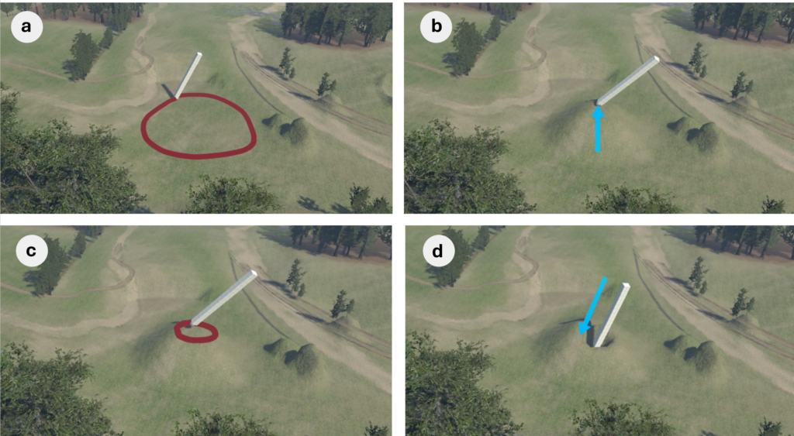

<article class="lab-blog-article">
  <header class="lab-blog-article-header">
    
Prof. Eyal Ofek

    
University of Birmingham, UK · August 2026

  </header>

  
Drawing on paper is generally easier and less tiring than drawing in mid-air. The table supports the hand, the surface provides resistance, and friction helps to stabilise fine movements. By contrast, creating three-dimensional content directly in space can introduce shaky strokes, depth errors and fatigue. Many designers therefore continue to model three-dimensional objects with two-dimensional tools such as mice and conventional styluses, despite the additional operations these tools require.

  
MagicPen explores whether a single device can combine the natural movement of drawing in three dimensions with the support and precision of working on a physical surface. The project brings together researchers from the Southern University of Science and Technology and the University of Birmingham. Their paper, <em>MagicPen: Enabling Dynamic Physical Scaffolding through Haptic Feedback for 3D Content Creation in VR with a Variable-length Stylus</em>, is due to appear at UIST 2026 in Detroit.

  <figure class="lab-blog-figure">
    
    <figcaption><strong>Figure 1:</strong> MagicPen is a variable-length haptic stylus for creating three-dimensional content in virtual reality. Extending the stylus represents reaching above the table; retracting it represents reaching beneath the table surface.</figcaption>
  </figure>

  <h2>A stylus that changes length</h2>

  
MagicPen resembles an ordinary stylus, but a motor-driven gear-and-rack mechanism allows its body to extend or retract by as much as 70 mm. The tip remains in contact with a real desk or tablet while the user's hand rises and falls. The hand therefore retains physical support even when the corresponding virtual point lies above or below the tabletop.

  
Visual feedback in a headset or other display establishes the relationship between the physical stylus and the virtual geometry. As the pen extends, the user can perceive its virtual tip as rising above the desk. As it retracts, the tip can appear to penetrate the surface and reach a point beneath it.

  <figure class="lab-blog-figure">
    
    <figcaption><strong>Figure 2:</strong> The stylus extends and retracts as it follows existing virtual geometry, producing the impression that its tip remains on the surface.</figcaption>
  </figure>

  <h2>Rigid and dynamic physical scaffolding</h2>

  
When the stylus changes length to follow an existing virtual surface, it provides what the researchers call <strong>rigid scaffolding</strong>. MagicPen can also reshape that surface. When the user holds a button, the stylus behaves as a dragging tool: pushing down retracts the pen and moves the selected point deeper, while pulling upward extends the pen and raises the point. The researchers describe this direct editing process as <strong>dynamic physical scaffolding</strong>.

  <h2>Three-dimensional modelling</h2>

  
The team demonstrates the technique in a virtual-reality world-building application. To create a building, the user draws a footprint on rolling terrain while the stylus follows the shape of the ground. The user then selects the footprint, holds the pen's button and lifts the stylus to extrude the building to the desired height.

  <figure class="lab-blog-figure">
    
    <figcaption><strong>Figure 3:</strong> The user first draws a closed contour on the terrain and then pulls upward with MagicPen to assign height to the building.</figcaption>
  </figure>

  
The same interaction supports terrain sculpting. A user can outline an area, select a point within it, and pull upward to form a hill. Drawing another contour on the hilltop and pushing downward can then create a depression. Moving directly between pulling and pushing allows the geometry to be edited through continuous hand movements without changing tools.

  <figure class="lab-blog-figure">
    
    <figcaption><strong>Figure 4:</strong> Terrain editing with MagicPen: defining a region, raising it into a hill, drawing on the hilltop, and pressing downward to form a depression.</figcaption>
  </figure>

  
MagicPen extends the familiar interaction of a two-dimensional stylus into three dimensions while retaining support from the physical work surface. Its variable length connects movements above and below the tabletop with corresponding changes to virtual geometry.

  <h2>Video</h2>

  <figure class="lab-blog-video">
    

      <iframe loading="lazy" title="MagicPen UIST 2026 video" src="https://www.youtube-nocookie.com/embed/stWjWZemYww" allow="accelerometer; autoplay; clipboard-write; encrypted-media; gyroscope; picture-in-picture; web-share" referrerpolicy="strict-origin-when-cross-origin" allowfullscreen></iframe>
    

    <figcaption><a href="https://www.youtube.com/watch?v=stWjWZemYww" target="_blank" rel="noopener">Watch the MagicPen video on YouTube</a>.</figcaption>
  </figure>

  
Adapted from <a href="https://eyalofek.org/research-blog-magicpen/" target="_blank" rel="noopener">Prof. Eyal Ofek's original research blog</a>.

</article>
