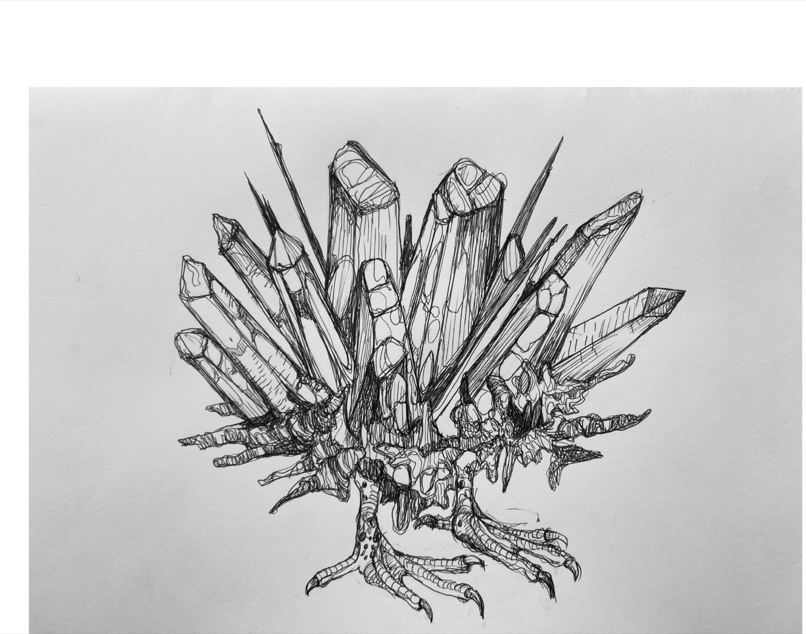
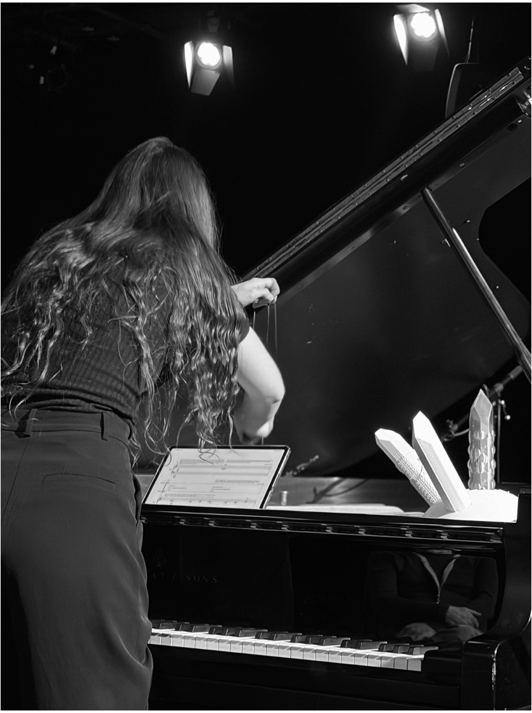

<article class="lab-blog-article">
  <header class="lab-blog-article-header">
    
Cristiana Palandri

    
Composer, visual artist and doctoral researcher · August 2026

  </header>

  
<em>OUROBOROS</em> is a theatrical work by Cristiana Palandri for grand piano, sculpture, live electronics and Ambisonics. It brings sound, image, material form and touch into a single performance: the sculpture is not simply a stage object, but an interface through which the performer and, eventually, an audience member can alter the electronic processing and movement of sound.

  
The work reflects Palandri's wider doctoral research into the "objectification" of sound-based composition. Her research asks how spatialised sound, three-dimensional objects and interactive interfaces might engage aural, visual and tactile perception together, while drawing audiences more directly into the creative process.

  <figure class="lab-blog-figure">
    
    <figcaption><strong>Figure 1:</strong> Palandri's drawing of the interactive crystal sculpture. Image reproduced from the <em>OUROBOROS</em> score supplied to the VR Lab.</figcaption>
  </figure>

  <h2>A sculpture that controls sound</h2>

  
Three crystal-shaped elements in the sculpture contain sensors. Their signals pass through an Arduino to a Max/MSP system, where they control digital signal processing and three-dimensional spatialisation. The score specifies third-order Ambisonics, with the spatial system adaptable to different multichannel loudspeaker configurations.

  
The sculpture sits inside the grand piano, above the agraffes and within the performer's reach. Its electronic transformations are joined by extended piano techniques: the score calls for VHS and cassette tape to be drawn across the strings, as well as conventional keyboard performance. These physical actions make the production and transformation of sound visible.

  <figure class="lab-blog-figure">
    
    <figcaption><strong>Figure 2:</strong> The sculpture is positioned inside the grand piano so that its crystal-shaped controls remain accessible during performance. Image reproduced from the <em>OUROBOROS</em> score supplied to the VR Lab.</figcaption>
  </figure>

  <h2>Myth, performance and participation</h2>

  
The performance is inspired by Celeno, one of the Harpies of classical mythology. Palandri's narrative follows Celeno through a fog-filled landscape towards a zoomorphic crystal: at once a mineral jewel, a messenger and a harpy. The pianist personifies Celeno, gradually approaching and touching the sculpture as fragments of melody come into focus.

  
Near the end, the performer invites a member of the audience to manipulate the sculpture while the electronics continue. This transition from watching to touching is central to the work: musical structure, spatial sound and material interaction become parts of the same experience.

  <h2>Performance video</h2>

  
The video below is a stereo version of a work conceived for an Ambisonic loudspeaker system. Headphones can help with the stereo recording, but they cannot reproduce the full spatial experience of the original performance.

  <figure class="lab-blog-video">
    

      <iframe loading="lazy" title="OUROBOROS for piano, sculpture, live electronics and Ambisonics" src="https://www.youtube-nocookie.com/embed/9y28gJDc1is" allow="accelerometer; autoplay; clipboard-write; encrypted-media; gyroscope; picture-in-picture; web-share" referrerpolicy="strict-origin-when-cross-origin" allowfullscreen></iframe>
    

    <figcaption><a href="https://www.youtube.com/watch?v=9y28gJDc1is" target="_blank" rel="noopener">Watch <em>OUROBOROS</em> on YouTube</a>.</figcaption>
  </figure>

  <h2>From performance to audience research</h2>

  
Palandri is developing a further installation planned for October 2026. Discussions with the VR Lab concern how quantitative audience studies could examine the relationship between sound and tactile perception: for example, how touching the sculpture changes the experience of spatial movement, agency and connection with the composition.

  
This direction closely matches her doctoral project, <em>Objectifying sound-based composition: exploring multisensory perception and audience engagement</em>, at De Montfort University. The project investigates how music, drawing and sculpture can form a responsive multimodal artwork rather than remain separate media.

  <h2>Related work: <em>Corpo sonoro</em></h2>

  
Palandri's related performance <em>Corpo sonoro</em> was presented at Triennale Milano on 25 March 2026 in collaboration with audiovisual artist Rosario Grieco and dancer Lorenza Sganzetta. The event combined listening in darkness to works diffused in Ambisonics with a spatialised live set, responsive architectural lighting and movement among the audience. Together, these elements explored how sound can be perceived as a physical presence.

  <figure class="lab-blog-video">
    

      <iframe loading="lazy" title="Corpo sonoro by Cristiana Palandri" src="https://www.youtube-nocookie.com/embed/b8gHvo2MED0" allow="accelerometer; autoplay; clipboard-write; encrypted-media; gyroscope; picture-in-picture; web-share" referrerpolicy="strict-origin-when-cross-origin" allowfullscreen></iframe>
    

    <figcaption><a href="https://www.youtube.com/watch?v=b8gHvo2MED0" target="_blank" rel="noopener">Watch <em>Corpo sonoro</em> on YouTube</a>.</figcaption>
  </figure>

  <h2>Credits and further material</h2>

  
<em>OUROBOROS</em> is a work by Cristiana Palandri. <a href="/author/yuehang-lin/">Yuehang "Clark" Lin</a> contributed hardware engineering and 3D-printed prototyping to the interactive crystal music installation.

  
Sources and further reading: <a href="https://www.midlands4cities.ac.uk/student_profile/cristiana-palandri/" target="_blank" rel="noopener">Palandri's Midlands4Cities research profile</a>; <a href="https://www.cristianapalandri.com/works/" target="_blank" rel="noopener">selected works</a>; <a href="https://triennale.org/eventi/corpo-sonoro-palandri" target="_blank" rel="noopener"><em>Corpo sonoro</em> at Triennale Milano</a>; and the <a href="https://spatialaudiogathering.github.io/April1.html" target="_blank" rel="noopener">2026 Spatial Audio Gathering programme</a>.

</article>
