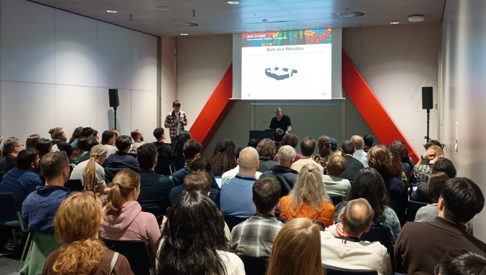
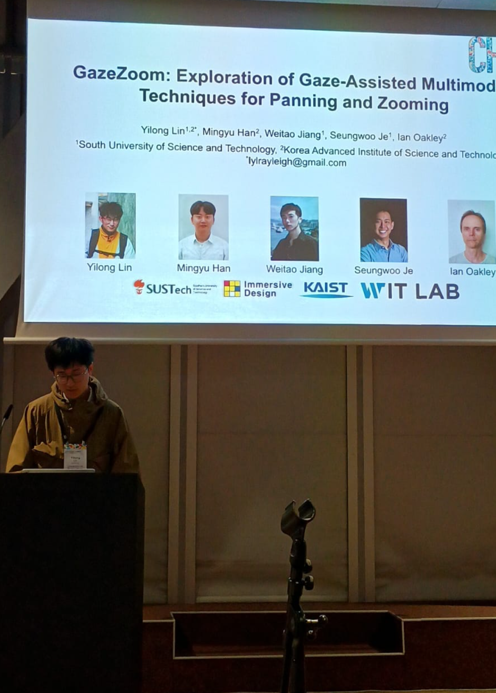
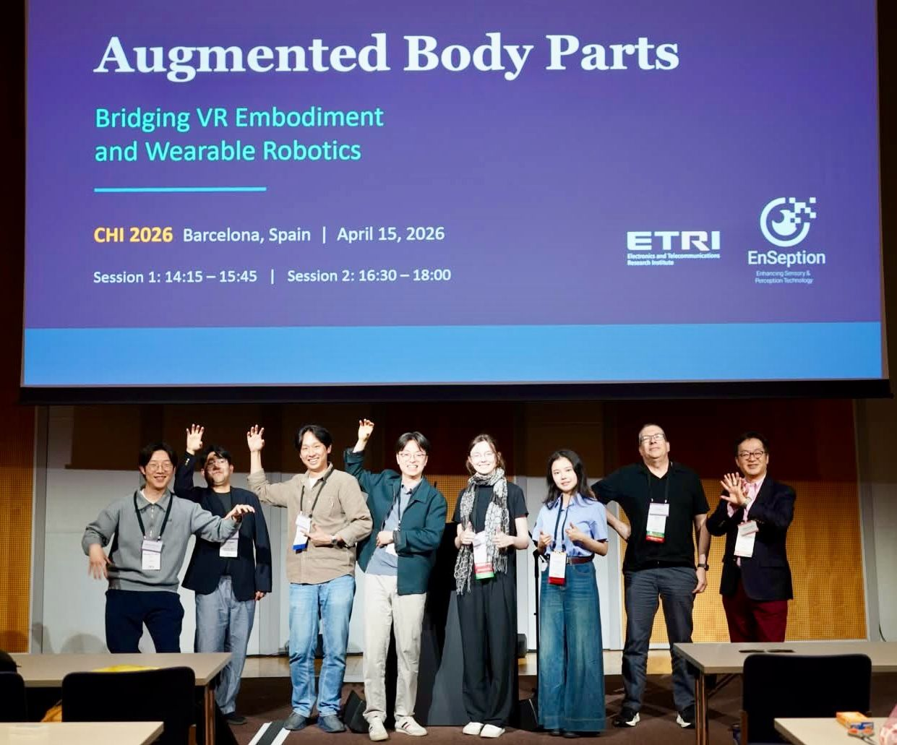
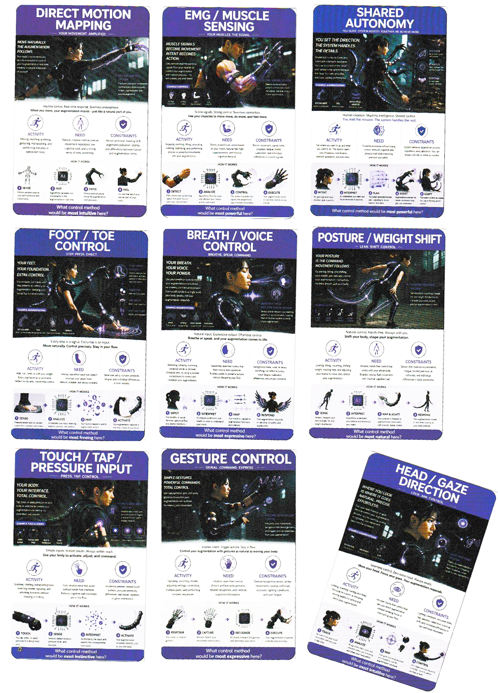

Members of the University of Birmingham VR Lab recently attended CHI 2026, where they presented and contributed to research exploring mixed reality, embodied interaction, and future forms of human-computer interaction.

The team shared work from the Belt & Whistles project, which investigates lower-body collision awareness for mixed reality experiences.

VR Lab members also presented work connected to the Articulation in Motion project, continuing the lab's research into body-based interaction and immersive technologies.

Alongside the conference presentations, the team contributed to a workshop on augmented mixed-reality and robotic body parts. The workshop was organised in collaboration with researchers from KAIST, ETRI, the University of Tokyo, Saarland University, UCL, and the University of Birmingham.

The workshop brought together researchers working at the intersection of virtual reality, robotics, body augmentation, and interaction design. It also featured Prof. Masahiko Inami from the University of Tokyo, making the session a valuable opportunity for discussion and exchange across institutions.

The visit highlighted the VR Lab's growing contribution to international research in immersive technologies and human-computer interaction.
